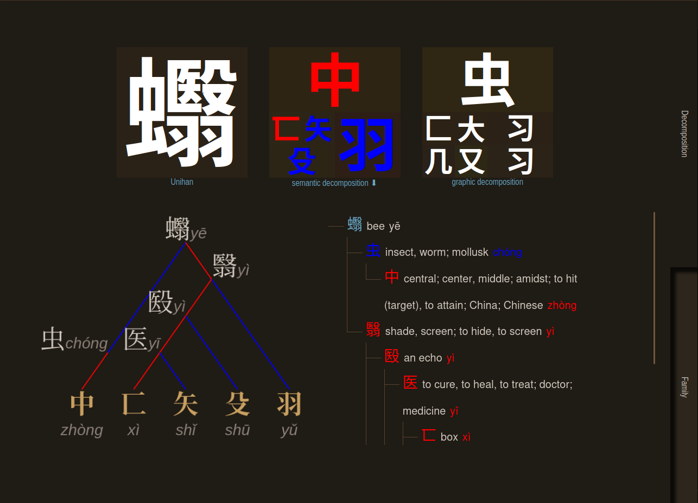
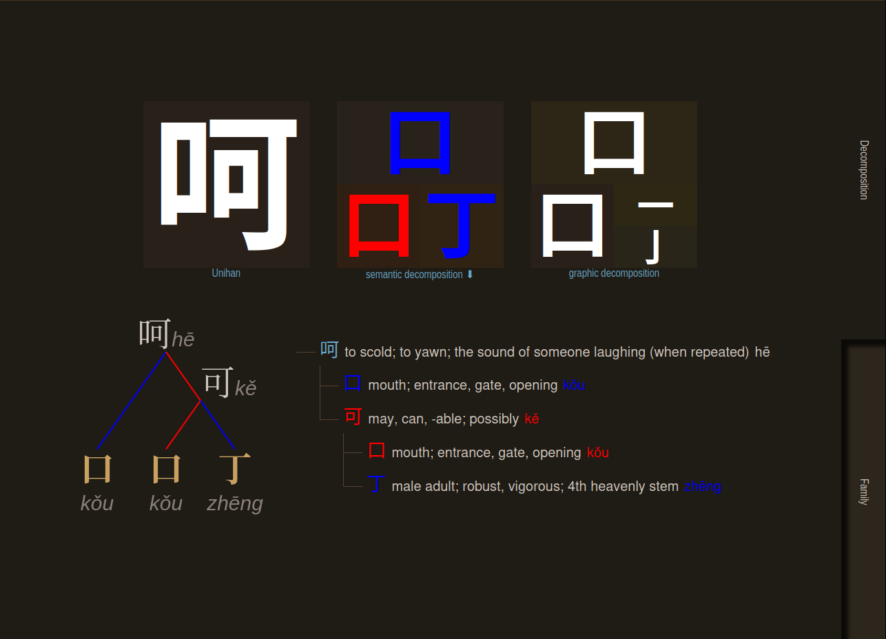
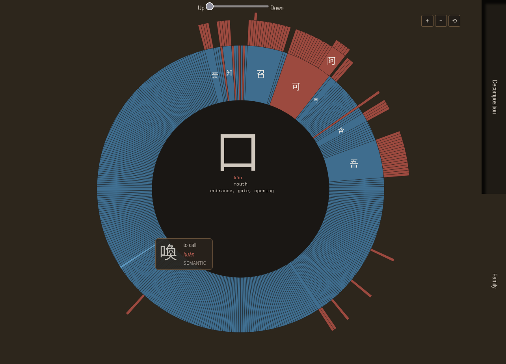
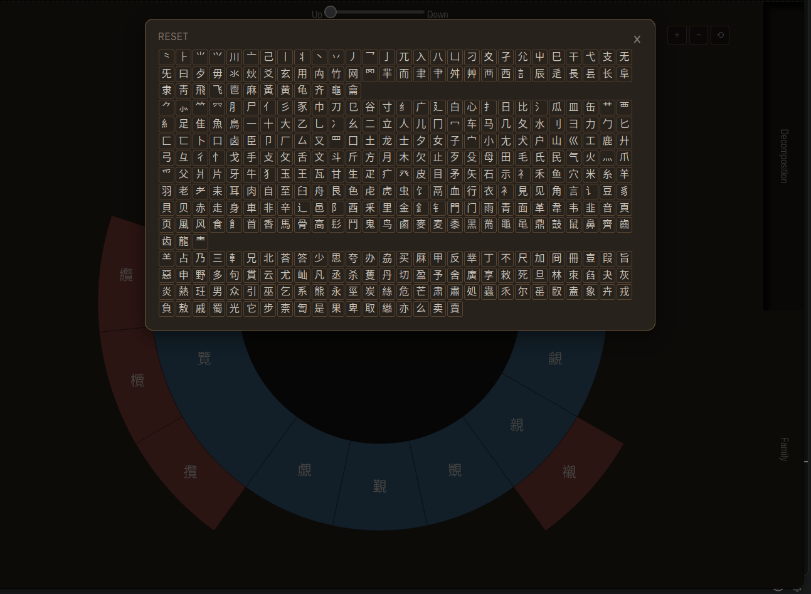

# Chinese logogram analysis

**Chinese writing is not a gallery of little pictures.** Of the 9574 characters
measured here, **227 are drawings of what they mean. That is 2.4 %.** Nearly
three quarters are something else, and something better: a component picked for
what it *means*, welded to a component picked for what it *sounded like*. Not a
picture — a two-part equation.

And because each part is itself a character, the equations **nest**. [蠮](https://alerojorela.neocities.org/writing/chineseGraphemes/analysis.html?q=%E8%A0%AE)
is a bee: 虫 "insect" for the sense, 翳 for the sound. 翳 is itself 羽 + 殹, 殹 is
殳 + 医, and 医 is 矢 + 匸 — five levels down before the chain runs out. Four
characters in the whole set go that deep, and this application was written to
draw them.

It takes one character apart, then takes its parts apart, and shows the result
three ways at once — a tree, a nested grid, and a zoomable ring of every
relative the character has, upwards as well as down. 9574 graphemes, 6966 of
them sound-and-sense compounds, with Old Chinese reconstructions for 3359.

[](https://alerojorela.neocities.org/writing/chineseGraphemes/analysis.html?q=%E8%A0%AE&tab=decomposition)

fig. [蠮](https://alerojorela.neocities.org/writing/chineseGraphemes/analysis.html?q=%E8%A0%AE) (bee), one of the four deepest characters in the set. **Every screenshot here is a link**: click one and the viewer opens on that character, on the tab the picture was taken from

## Pictogram, ideogram, logogram, phonosemantogram

Four words used as if they were one. What separates them is **what the sign
points at**:

| | Points at | So it can be read by |
|---|---|---|
| **pictogram** | a thing, by resembling it | anyone, in any language |
| **ideogram** | an idea, by convention | anyone who knows the convention: ⚠, ☮, 🚭 |
| **logogram** | a **word** of one particular language, its sound included | only someone who speaks that language |

**A pictogram is not a logogram, and neither is an ideogram.** They point at
things and at ideas; a logogram points at a word. A road sign is not writing,
and that is the whole difference.

Every Chinese character in use today **is** a logogram: it stands for a word, it
has a reading, and nobody can pronounce it without knowing Chinese. What the
traditional classes describe is therefore not what a character *is* but how it
was once **designed**. The dataset says so in one field, `etymology.type`:

| Design | Entries | Share | What was done |
|---|---:|---:|---|
| **pictographic** | 227 | 2.4 % | the thing was drawn: [木](https://alerojorela.neocities.org/writing/chineseGraphemes/analysis.html?q=%E6%9C%A8) "a tree", [口](https://alerojorela.neocities.org/writing/chineseGraphemes/analysis.html?q=%E5%8F%A3) "an open mouth" |
| **ideographic** | 1840 | 19.2 % | meanings were put together: [林](https://alerojorela.neocities.org/writing/chineseGraphemes/analysis.html?q=%E6%9E%97) "two trees representing a forest", [灾](https://alerojorela.neocities.org/writing/chineseGraphemes/analysis.html?q=%E7%81%BE) "a house 宀 on fire 火" |
| **phonosemantic** | 6966 | 72.8 % | one part for the sense, one for the sound |
| *not stated* | 541 | 5.7 % | |

The third row is what this application is named after. A **phonosemantogram**
(形声字) pairs a **semantic** component, which says roughly what the word is
about, with a **phonetic** one, which says roughly how it sounded. Two warnings
the rest of this README spends its time on:

- **The sound is not today's sound.** The phonetic component recorded a
  pronunciation of two or three thousand years ago. In modern Mandarin a
  phonetic family can be 各 *gè*, 格 *gé*, 洛 *luò* — no family at all to the
  ear. That is why the Old Chinese reconstruction is printed first and the
  pinyin second.
- **The two relations are not the same shape.** The phonetic one is a genealogy
  and runs deep; the semantic one is a classification and runs wide. 氵 alone has
  395 children and no grandchildren.


## Composition trees, and the graph editor

**Decomposition** goes **down** from a character to its components, drawn three
ways at once. **Family** goes both ways: down to what the character is made of,
and up to a component, the characters that use it, and the characters that use
those.

```
各 *kˤak      individual; each, every
  格 *kˤrak     form, pattern, standard
  洛 luò        a river in Shanxi
    落 *kə.rˤak   to fall, to drop
```

**The branch only sounds alike in Old Chinese.** In pinyin it reads gè, gé, luò —
no family at all. That is why pronunciation is printed before meaning and why the
Baxter-Sagart reconstruction outranks pinyin: it is the evidence, and the gloss is
the commentary. 3359 entries carry Baxter-Sagart, and coverage rises to 69 % on
the 1556 components that root a tree.

The two views are **not symmetric, and the data says so**: the phonetic relation
is a genealogy (depth up to 5, at most 28 direct children), while the semantic one
is a classification (304 of its 328 components have depth 2, and 氵 alone has 395
children with no grandchildren). The picker therefore offers, in the semantic
view, only the **24 components with real depth**.

**A node is a word, not a glyph.** The traditional and simplified spellings of the
same word are one node with two spellings, and the two checkboxes choose which of
them show: both, either, or — with both cleared — the node goes. They were two
sibling nodes until 2026-09-14, which claimed a family relation where there is one
character written twice. Counting words instead of glyphs is what makes the trees
report 1522 phonetic components where [the measurements](#11-traditional-and-simplified)
report 1556.

**Or open the whole forest.** The picker's first entry drops the single root and
lists every component that nothing else composes: 1105 in the phonetic view, 304
in the semantic one. Folded, so it paints at once; each one unfolds its branch on
click. Maximal roots and not all 1556, because over those each grapheme appears
exactly once — listing every component instead would print 格 twice, inside 各 and
again as a root of its own.

What the tree marks:

| Mark | Meaning |
|---|---|
| Amber grapheme | Not attested in the classical corpus — where the 20th-century coinages land: 氫 ammonia, 烴 hydrocarbon, 砼 concrete |
| ⚠ on an edge | Karlgren's GSR puts the two characters in different phonetic series. 88 % of checkable edges agree; these are the 12 % under discussion |
| Two glyphs, the second dimmed | A variant pair, one node. The traditional spelling is the one carrying the reading printed beside it. Detected rather than declared: the dataset has no such field |

`tools/graph_export.py` writes the same relations in the format read by
[basic_graph_editor](https://github.com/alerojorela/basic_graph_editor), one
family per file, with `tools/editor-config.json` for the categories and tooltips:

```bash
python3 tools/graph_export.py --families 12 --out ../basic_graph_editor/samples
python3 tools/graph_export.py --kind semantic --root 艹 --out graphs
```

The whole graph is 9574 nodes and does not fit: the editor's largest tested graph
is 216 nodes. Phonetic families top out at 60; semantic ones do not fit either
(艹 is 356).

## Interface

<p>This is the color key for <span style="color: blue">semantic </span> and <span style="color: red">phonetic</span> components</p>

[](https://alerojorela.neocities.org/writing/chineseGraphemes/analysis.html?q=%E5%91%B5&tab=decomposition)

fig. [呵](https://alerojorela.neocities.org/writing/chineseGraphemes/analysis.html?q=%E5%91%B5) hē (to scold): 口 "mouth" gives the sense, 可 kě gives the sound — and 可 is itself a compound, 口 for sound over 丁 for sense. The same two colours all the way down

[](https://alerojorela.neocities.org/writing/chineseGraphemes/analysis.html?q=%E5%8F%A3&tab=family)

fig. Family tab renders an interactive (by using d3.js) radial diagram. Shows descendants too, but also ancestors (logograms that contains the selected one)


Click over current logogram to browse logograms by radicals and by semantic components

[](https://alerojorela.neocities.org/writing/chineseGraphemes/analysis.html?q=%E8%A6%8B&tab=family)


## Browsing the whole set

`browse.html` is the set; `analysis.html` is one character. That split is what
decides where anything goes.

Two ways to pick rows, because they answer different questions:

- **By property.** Two real partitions (origin, layout), three depth measures,
  strokes, and five filters. Every number behind a control is measured in
  [The dataset, measured](#the-dataset-measured), below.
- **By enumeration.** Paste a list of characters and only those survive. No
  filter replaces this: a vocabulary list out of a textbook is not a property.
  Anything pasted that is not a grapheme is ignored, so pasting prose works.

Columns are chosen, with presets for study, etymology, sound and shape, and the
filtered rows copy out as TSV. The old links survive as URL parameters:
`browse.html?origin=pictographic&cols=etymology`.

The **composition trees** live here too, for the same reason: a tree starts at a
component and unfolds its whole family, which is a view of the set.

<!-- BEGIN STATS -->
<!-- Generated by tools/build_stats.py. Do not edit between the markers. -->
## The dataset, measured

Every figure below is recomputed from `data/derivedmergeddata.js` by
`tools/build_stats.py`, so it cannot drift from the data. This is both the
inventory of what the browse page can offer as a partition, a scale or a
filter, and the record of what has been measured, so as not to measure it
twice.

**9574 entries in all.**

### 1. What an entry carries

Before counting anything, how much data there is. A column with 35 % coverage
cannot be offered the same way as one with 100 %.

| Field | Entries | Coverage |
|---|---:|---:|
| `radical` | 9574 | 100.0 % |
| `pinyin` | 9565 | 99.9 % |
| `decomposition` | 9574 | 100.0 % |
| `definition` | 9516 | 99.4 % |
| `etymology.hint` | 8948 | 93.5 % |
| `graphicaldecomposition` | 9256 | 96.7 % |
| `etymology` | 9033 | 94.3 % |
| `etymology.semantic` | 6917 | 72.2 % |
| `etymology.phonetic` | 6809 | 71.1 % |
| `BaxterSagart` | 3359 | 35.1 % |

**`hint` is the most didactic field and the least used**: it covers 93.5 % and is
plain prose explaining the composition — ⺊ "A crack on an oracle bone",
灾 "A house 宀 on fire 火".

### 2. Origin: how pictograms, ideograms and phonosemantograms are told apart

It is not interpretation: it is the **`etymology.type`** field, which comes
from makemeahanzi (Unihan + CJKlib).

| Class | Entries | Of the total | Of those with an etymology |
|---|---:|---:|---:|
| `pictophonetic` | 6966 | 72.8 % | 77.1 % |
| `ideographic` | 1840 | 19.2 % | 20.4 % |
| `pictographic` | 227 | 2.4 % | 2.5 % |
| *no etymology* | 541 | 5.7 % | — |

It is a **partition** — each entry falls in one class and only one — but over
the **9033 that have an etymology, not over the 9574**. The other 541 say nothing.

And the largest class is not homogeneous. Of the 6966 phonosemantograms, **6760
declare both parts**; 157 do not say which is the phonetic one and 49 do not say
which is the semantic one. Filtering by "phonosemantogram" therefore returns 6966
entries of which 206 cannot be taken apart.

### 3. Divisibility: there are **three** measures, not one

This is the easiest place to go wrong, and it happened: a workshop note said 7
and a later measurement said 8 **for the same character**. They do not
contradict each other; they measure different things over different sources.

The convention, here and in the article: **a grapheme that does not come apart
is 0**.

| Level | Etymological | Graphic IDS | Graphic Wikimedia |
|---:|---:|---:|---:|
| 0 | 2608 | 84 | 350 |
| 1 | 5474 | 275 | 2120 |
| 2 | 1394 | 816 | 4100 |
| 3 | 94 | 1987 | 2421 |
| 4 | 4 | 2973 | 515 |
| 5 | — | 2486 | 54 |
| 6 | — | 827 | 12 |
| 7 | — | 116 | 2 |
| 8 | — | 10 | — |

- **Etymological** — `etymology.semantic` + `etymology.phonetic`, recursive.
  Tops out at **4**, reached by **4**: 礴 臟 蘩 蠮
- **Graphic IDS** — `decomposition`, the n-ary ⿰⿱⿲… tree.
  Tops out at **8**, reached by **10**: 儺 擲 攤 灘 癱 縮 缩 蓿 襫 躑
- **Graphic Wikimedia** — `graphicaldecomposition`, binary left/right.
  Tops out at **7**, reached by **2**: 擲 躑

The etymological one is the article's: **4, and only 礌 臟 蘙 蟮**. The Wikimedia
one is that of `0OFFLINE/mi análisis/ConclusionsGraphic2Recursivity.md`: **7, and
only 擲 蹑**, which is why 蹑 is the character `analysis.html` opens with.

### 4. Radical against semantic component

The radical is the dictionary's postal address; the semantic component is an
etymological fact. They almost always agree, and where they do not is where
convention parts from history.

| | Entries |
|---|---:|
| With a declared semantic component | 6917 |
| The radical **is** the semantic component | 6646 (96.1 %) |
| The radical is **something else** | 271 (3.9 %) |

And as sets they **overlap; neither contains the other**:

| | How many |
|---|---:|
| In both roles | 227 |
| Radical only | 68 |
| Semantic component only | 102 |

Examples where they diverge:

| Grapheme | Radical | Semantic | Meaning |
|---|---|---|---|
| 举 | 丶 | 扌 | to raise; to recommend; to praise |
| 义 | 丿 | ⺷ | right conduct, propriety; justice |
| 乩 | 乚 | 占 | to divine |
| 亩 | 亠 | 田 | fields; unit of area equal to 660 sq. m. |
| 仍 | 亻 | 乃 | yet, still; keeping, continuing; again |
| 仨 | 亻 | 三 | three (cannot be followed by a measure w |

### 5. Layout in the square

The top-level IDS operator. It is the second true partition.

| Operator | What it says | Entries | |
|---|---|---:|---:|
| ⿰ | left · right | 6090 | 63.6 % |
| ⿱ | top · bottom | 2212 | 23.1 % |
| ⿸ | surrounds top-left | 377 | 3.9 % |
| ⿺ | surrounds bottom-left | 212 | 2.2 % |
| ⿻ | overlaid | 206 | 2.2 % |
| ⿵ | surrounds from above | 142 | 1.5 % |
| ⿳ | three stacked | 89 | 0.9 % |
| ⿹ | surrounds top-right | 70 | 0.7 % |
| ⿴ | fully surrounds | 46 | 0.5 % |
| ⿲ | three in a row | 30 | 0.3 % |
| ⿷ | surrounds from the left | 22 | 0.2 % |
| ⿶ | surrounds from below | 8 | 0.1 % |
| ？ and others | not decomposed | 70 | 0.7 % |

4 entries have a decomposition with no operator, and they are not
malformed: they are **derivation by stroke modification**, a relation the IDS
format has no way to name.

| Grapheme | Derives from | Meaning |
|---|---|---|
| 丁 | 一 | male adult; robust, vigorous; 4th heaven |
| 乡 | 幺 | country, village; rural |
| 孓 | 子 | mosquito larva |
| 由 | 田 | cause, reason; from |

### 6. Order of the parts

| Order | Entries |
|---|---:|
| `sem-phon` | 5666 |
| `phon-sem` | 1193 |
| `(not stated)` | 107 |

### 7. How far back the evidence goes

Which stage of the language backs each grapheme. It matters because **a
phonetic branch only sounds alike in Old Chinese**: in modern Mandarin 各 gè,
格 gé and 落 luò look like no family at all, and in Old Chinese `*kˤak`,
`*kˤrak` and `*kə.rˤak` are one beyond argument.

| Stage | Entries | |
|---|---:|---:|
| Old Chinese (Baxter-Sagart) | 3359 | 35.1 % |
| Middle Chinese only | 0 | 0.0 % |
| Modern pinyin only | 6206 | 64.8 % |
| Nothing | 9 | 0.1 % |

**There is not one case of Middle Chinese without Old Chinese**: in practice the
scale is binary, attested or not. And the "pinyin only" bucket is where the
20th-century coinages land — 氫 ammonia, 烴 hydrocarbon, 砼 concrete — which use
the same procedure two thousand years later. **The data cannot say "coinage"**,
only "unattested in the classical corpus".

### 8. What each grapheme does with the others

| Role | How many |
|---|---:|
| Serves as a **phonetic** component to others | 1556 |
| Serves as a **semantic** component to others | 329 |
| Does both | 263 |
| Phonetic only | 1293 |
| Semantic only | 66 |
| **Composes nothing** (a leaf of the system) | 7952 (83.1 %) |

**83.1 % of graphemes compose nothing.** The system has a small set of parts
— 1556 phonetic and 329 semantic — and a very long tail of leaves. And the two
kinds are not evenly shared: **1556 phonetic components against 329 semantic**,
which is the asymmetry underneath the whole system.

From which it follows that **the semantic relation is not a tree but a
classification**: only **23** of the 329 semantic components have any depth;
氵 has 399 children and no grandchildren. The phonetic one really is a
genealogy.

| Most prolific | |
|---|---|
| Phonetic | 令 (28) · 隹 (26) · 各 (26) · 古 (25) · 非 (25) |
| Semantic | 氵 (399) · 艹 (353) · 口 (327) · 木 (303) · 扌 (276) |

### 9. Strokes

**`len(matches)` is the stroke count.** It is documented nowhere and was
deduced: checked against 13 control characters — 龠 = 17 ✓, 龍 = 16 ✓ — and
then against Baxter-Sagart over 265 variant pairs, where **261 agree** that the
attested member is the one with more strokes.

Range **1 to 33**, median **11**.

### 10. Agreement with Karlgren

The `BaxterSagart.GSR` field is Karlgren's phonetic series number, and it works
as an **independent check on every phonetic edge**: if two related graphemes
fall in the same series, the relation is confirmed by a source other than the
one that asserted it.

| | Edges |
|---|---:|
| Same series: the relation is confirmed | 1521 (88.1 %) |
| Different series: the relation is disputed | 205 (11.9 %) |
| No data at one end | 5083 |

That 11.9 % that disagrees is not noise in the way: it is where a reader learns
that this is reconstruction and not dogma, which is why it is marked rather
than hidden.

### 11. Traditional and simplified

**The data has no field for this.** They are detected as siblings under the
same phonetic component that share pinyin **and** definition. Within the pair,
the one in Baxter-Sagart is the traditional form; if neither is, the one with
more strokes.

| | How many |
|---|---:|
| Variant groups detected | 602 |
| Graphemes involved | 1204 |
| Decidable by Baxter-Sagart | 265 |
| Decided by stroke count | 337 |

**Only pairs that are siblings are visible.** A pair split across two different
branches is never matched, and there is no telling how many those are. With
Unihan's `kSimplifiedVariant` this would be exact instead of heuristic.

**Counting words instead of glyphs changes the totals**, which is what the
composition trees do: there a pair is one node with two spellings, not two
siblings that happen to mean the same.

| | Glyphs | Words |
|---|---:|---:|
| Phonetic components | 1556 | 1522 |
| Semantic components | 329 | 328 |
| Semantic components with depth | 23 | 24 |
| Children of 氵 | 399 | 395 |

⭐ **The merge does not only subtract: it creates one level of depth.** A
semantic component whose two spellings each composed a different grapheme
was two flat entries and becomes one node with a generation under it, which
is why the trees offer 24 semantic roots and this page counts 23.

### 12. What is a partition and what is a facet

This is what decides the design of the browse page. Mixing them into a single
menu would misrepresent the data.

| Kind | Which |
|---|---|
| **Partitions** (one selector, exclusive) | Origin · Layout |
| **Scales** (a range) | Etymological divisibility · IDS · Wikimedia · Strokes |
| **Filters** (a checkbox) | Attested in Old Chinese · Radical ≠ semantic · Composes others · Karlgren disagrees · Is a variant |
| **Enumeration** (paste a list) | Only the characters you paste survive |

<!-- END STATS -->

## Layout

The application lives at the repository root and is **self-contained**: it ships
its own `js/`, `style/`, `jsexternal/` and `img/`, so the same relative paths
resolve whether you open `index.html` from disk or reach it on the site. Nothing
is borrowed from the host page.

| | |
|---|---|
| `index.html` | The front door, listing every page below |
| `analysis.html` | The viewer, one character at a time, in two tabs. The URL says which and which: `?q=蠮` picks the character, `&tab=family` picks the tab (`decomposition` is the default, and an unknown name is ignored rather than argued with) |
| `browse.html` | The whole set: filters, chosen columns, and the composition trees |
| `article.html` | The write-up. `article.es.html` is the Spanish original it was translated from |
| `graphemesCulturalHints.html` | The cultural hints, read off the same dataset. Spanish original in `graphemesCulturalHints.es.html` |
| `data/` | `derivedmergeddata.js`, 9574 entries |
| `img/graphemes/` | The figures the article uses |
| `capture*.png` | The screenshots this README shows. Not deployed |
| `tools/` | `build_stats.py`, `build_inventory.py`, `graph_export.py`, the editor config, and the binary-division tool |
| `0OFFLINE/` | Workshop: raw sources, drafts and analysis notes. Not published, not versioned |

## Sources

[`SOURCES.md`](SOURCES.md), and the same thing as a page in `sources.html`: the
three sources, their licences, how much of each one did not reach the dataset,
and the seven places where they disagree.


## To-do

Improve text scaling

Add an example tab to show sentences related to logogram components

Get orientation data: ⿰ or ⿱

Improve logogram selector: multiselection


------

2019 Alejandro Rojo Gualix

MIT — see [LICENSE](LICENSE). Attribution is the only condition.
